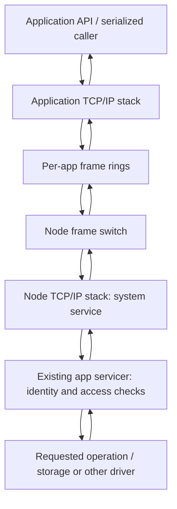

# Architecture

HopOS runs Go applications directly on hardware using TamaGo. The node kernel assigns memory and cores, starts applications, provides shared services, and manages their lifetime. Applications execute in their own memory partitions with their own runtimes and network stacks.

Dedicated placement gives an application separate execution capacity. Explicitly trusted applications can share cores cooperatively. Both forms retain separate memory partitions. An SMP application owns several dedicated cores. Placement options are described in [Applications](apps.md).

## Shared framework and hardware mechanisms

The framework decides who owns a resource and when ownership may change. Architecture-specific code establishes the protection boundary, starts or switches execution, and confirms termination. Board code supplies the hardware operations available on that machine.

| Layer | Responsibility | Source |
| --- | --- | --- |
| Layout and placement | Memory regions, ABI structures, ELF bounds and placement | [abi/layout](../metal/abi/layout/), [abi/place](../metal/abi/place/) |
| Application lifecycle | Partitions, core claims, sharing, start, stop and adoption | [kern/slots](../metal/kern/slots/) |
| Architecture boundary | Privilege, address translation, context dispatch and revocation | [cage.go](../metal/kern/slots/cage.go), [cpu](../metal/cpu/) |
| Board integration | Physical core IDs, memory map, boot, reset, idle and wake operations | [board](../metal/board/) |
| Network and services | Frame switching, TCP/IP, application requests and access checks | [net](../metal/net/), [system.go](../metal/kern/slots/system.go) |
| Device access | NIC, storage and optional peripherals selected by the board | [Boards and drivers](boards-drivers.md) |

On ARM64, HOP runs at EL2 and applications at EL1; stage-2 translation bounds their physical access. On RISC-V, HOP runs in machine mode and applications in supervisor mode; PMP bounds physical access and Sv39 provides translation. The common cage interface gives both implementations the same lifecycle responsibilities.

A cage identifies an application and its partition. A core identifies an execution resource. Their numbers need not match: several cages can share one core, and one SMP application can own several cores. Each application receives one first-free cage ID. The node selects physical cores separately, including the contiguous run for an SMP app. Secondary CPU contexts use separate space in the existing administration region; they do not occupy another application's cage or IP address.

## An application request

The standard application library sends system requests over its existing network connection. The node identifies the originating app and dispatches the request through that app's servicer.

The system service uses the ordinary internal LAN. Filesystem operations, explicit object-store operations and normal app logging use this path. The servicer retains the app's root, mounts and job identity; the request does not choose a new identity.

This serialization belongs to the standard client of one app. Different apps have separate connections and servicers. It is not one global worker for every application. Ordinary app-to-app traffic is switched between frame rings without passing through the node's TCP stack. External traffic uses the node's NIC and NAT path. See [Networking](networking.md).

Boot, context switches and core wakeups use architecture mechanisms. They are not TCP requests. Fatal runtime output also has a bounded fallback when normal logging cannot proceed.

## Ownership and progress

A new owner receives initialized memory. A stopped owner releases its partition and execution claims only after termination and outstanding access have been confirmed. A sleeping context remains an owner. If termination is uncertain, its claims remain reserved.

Conflicting lifecycle operations use the existing lifecycle window. Short locks protect concurrently accessed bookkeeping. Application computation and I/O continue independently of the ordering of management operations. [Lifecycle](lifecycle.md) describes these rules and the wait/wake protocol.

The logical doorbell tells a resident to inspect published work. Its physical implementation depends on the architecture and board. The design's single network-IRQ direction is separate from internal events, IPIs and currently used polling paths; physical IRQ integration is tracked in [Status](status.md).

## Replacing the node kernel

A [kernel flip](kernel-flip.md) places a new kernel in a borrowed pool window and transfers ownership records. Applications keep their memory and execution contexts. The replacement kernel reconstructs claims before accepting new placement.

Build instructions and source boundaries are in [Development](development.md). Board capabilities are in [Boards and drivers](boards-drivers.md); measured costs and current test coverage are in [Measurements](measurements.md) and [Status](status.md).
