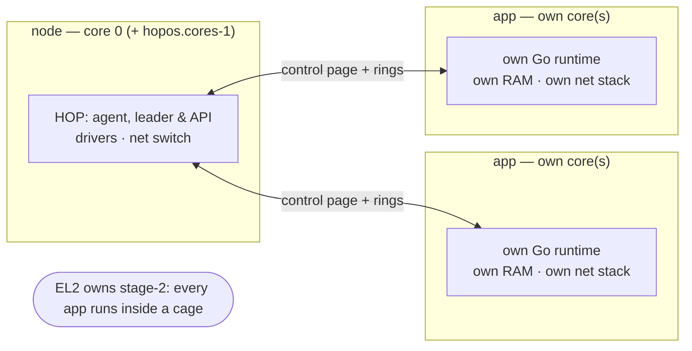

# Architecture

HopOS is a **multikernel**: the machine is divided by core, not by time.

- **The node runtime is just an app too.** HOP runs on core 0 (plus
  `hopos.cores-1` extra cores if configured); Go's scheduler spreads it —
  nothing is pinned.
- **Every app is its own kernel.** Each job gets a full Go runtime on its
  own physical cores at EL1, in its own memory partition, mapped through
  its own stage-2 table. There is no shared kernel to call into: the
  app↔node ABI is a control page (status, heartbeat, kill, telemetry) and
  two message rings.
- **Two-phase loading.** The node starts a tiny baked-in *apploader* on the
  target core; it downloads the real image **on its own core and its own
  network stack**, straight into its own partition, then the app places
  itself and boots. A storm of 127 job starts never funnels through core 0.
- **No interrupts.** Everything polls; idle cores sleep on the ARM event
  stream (~1 ms granularity) and are woken by work. Fewer moving parts,
  no IRQ routing, deterministic behaviour.
- **Discovery, not configuration.** UEFI boards read ACPI (MADT, MCFG,
  SPCR, GTDT); Pis read the device tree. The same job runs on any board —
  core count is your headroom.

Depth (Dutch design notes): [uefi](../archief/uefi.md),
[rpi5](../archief/rpi5.md), [memory layout](../archief/app-memory.md),
[layering rules](../archief/indeling.md).
