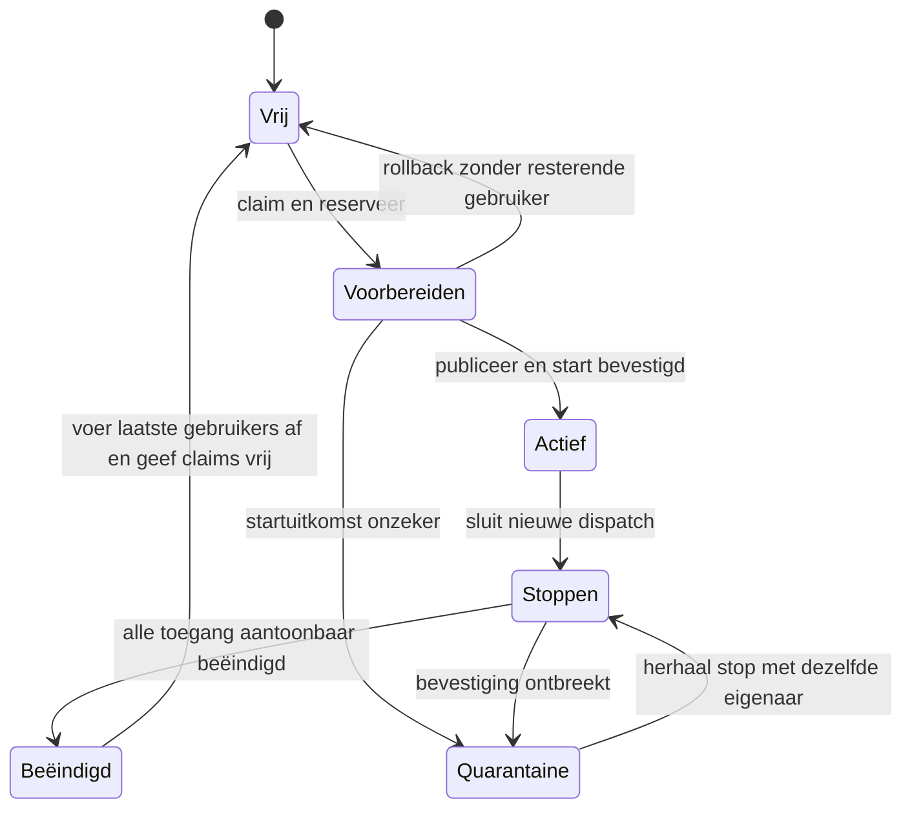

# Draaiboek van het framework

De resterende uitvoering en het eindcriterium staan in het [afrondingsplan voor de release](release-afronding.md). Dit document blijft de inhoudelijke meetlat.

Status: toegepast bij de frameworkreparatie van 6 september 2026; zie [wijzigingen en testbewijs](../reviews/2026-09-06-framework/fixes/README.md). Dit beschrijft het gewenste gedrag en de wijzigingsvolgorde voor de eerste release. Hardware- en prestatietoetsen hebben een afzonderlijke status; dit is geen universele correctheidsverklaring. Het vertrekpunt is het bestaande ontwerp, de [isolatietabel](isolation.md) en de [frameworkreview](../reviews/2026-09-06-framework/README.md).

## 1. De opdracht blijft klein

**Eén netwerk-IRQ. Eén logische deurbel per bewoner. Eén eigen geheugenstuk per app. Een actie afmaken, daarna de volgende.** Dit is de meetlat voor de implementatie; de verdere uitwerking hieronder moet deze eenvoud dienen.

| Handeling | Het eenvoudige draaiboek |
| --- | --- |
| Start | Reserveer geheugen en core(s), maak het geheugen schoon, zet beeld en kooi klaar, start. |
| Werk melden | Schrijf het werk weg, publiceer het, bel de bewoner. De bewoner leest zijn werk en handelt het af. |
| Wachten | Controleer of er werk is; slaap alleen met een werkende wekroute. Na wekken opnieuw kijken. |
| Stop | Rond lopende toegang af, stop de app, bevestig dat hij klaar is, geef zijn geheugen en coreclaim vrij. Een core met een andere bewoner of expliciete groepsreservering blijft bezet. |
| Flip | Rond beheeracties af, draag bestaande eigenaren over, ga verder met de nieuwe kernel. De apps behouden hun geheugen en uitvoering. |
| Stop niet bevestigd | Laat de eigenaar en zijn claims staan, meld de fout. Geen automatische herstelmachine eromheen. |

### Volgorde vóór extra synchronisatie

Eén plek beslist over starten en vrijgeven van een eigenaar. Handelingen die diezelfde eigenaar veranderen gebeuren na elkaar. Gebruik daarvoor eerst de bestaande aanroepvolgorde en runner/servicer; maak er geen nieuwe algemene commandowachtrij of laag per resource bij.

- Maak een actie volledig af voordat de volgende conflicterende actie begint. Dat geldt ook voor het starten van een secundaire core tegenover Stop.
- Gebruik bestaande exclusieve schrijvers. Voeg geen mutex, pending-teller, achtergrondtaak of kopie van de administratie toe als een gewone aanroepvolgorde het probleem oplost.
- Waar gedeelde administratie werkelijk tegelijk wordt benaderd, blijft de kleinst noodzakelijke synchronisatie staan. Houd die kort; wacht niet op hardware, downloads of callbacks terwijl je hun benodigde lock vasthoudt.
- Onafhankelijke apps blijven tegelijk computen en I/O doen. Lifecycle-volgorde maakt geen globale file van het datapad. Een download naar een eigen gereserveerde partitie blokkeert geen ongerelateerd werk.

**Een deurbel betekent alleen: kijk naar je werk.** De bestaande ring/control-page draagt de inhoud; de bel is geen berichtenteller. Meerdere meldingen mogen samenvallen zolang de ontvanger het gepubliceerde werk controleert voordat hij weer slaapt. RX, beheer en runtime-wake gebruiken hetzelfde logische wekpad waar hun wachtvoorwaarden dat toelaten. Geen afzonderlijke scheduler of bel-infrastructuur per werksoort. De architectuur vertaalt dit naar het nodige event/IPI op de juiste core(s), ook bij SMP; dit belooft niet één fysiek interruptbit voor de hele machine.

HOP verdeelt geheugen en cores, brengt een app binnen zijn kooi in uitvoering, laat hem slapen en wekt hem, beëindigt zijn eigendom en kan het node-kernelbeheer overdragen aan een volgende kernel. Een sharegroup laat expliciet vertrouwde apps coöperatief dezelfde cores gebruiken. Elke app behoudt zijn eigen geheugenkooi.

Dedicated is de standaard. SMP reserveert meerdere dedicated cores voor één app. Een gedeelde app gebruikt één core binnen de groepspool; SMP en sharegroup worden voor deze release niet gecombineerd. Een app die op een gedeelde core nooit yieldt kan zijn groepsgenoten ophouden: dit contract voegt geen preëmptieve scheduler of gegarandeerde CPU-percentages toe.

De architectuur bepaalt **hoe** een kooi begrenst, een context start, een core wacht en een intrekking bevestigd wordt. Het gedeelde framework bepaalt **wanneer** dat mag en wie eigenaar blijft. Drivers komen later aan bod; hun geheugen- en grant-overdracht moet wel aan dit eigendomscontract aansluiten.

## 2. Vier begrippen, één eigenaar

| Begrip | Betekenis | Vertrouwde administratie |
| --- | --- | --- |
| Kooi / app-eenheid | Eén app met eigen partitie en één of meer uitvoeringscontexten | HOP houdt identiteit, partitie, core-toewijzing, groepslidmaatschap en lifecycle bij. |
| Core | Hardware waarop contexten draaien of wachten | De boardlaag vertaalt logische nummers naar fysieke cores/harts. |
| Uitvoeringscontext | De bewaarde of actieve uitvoering op een core | De switcher en HOP hebben expliciete schrijfrollen; Running/Saved/Dead beschrijft uitvoering. |
| Partitie | Het geheugen dat aan één eigenaar is toegewezen | De allocator kent bereik en eigenaar, ook tijdens voorbereiding en quarantaine. |

Kooinummer en corenummer zijn geen algemene synoniemen. Een saved context is een levende eigenaar; een slapende core is niet vrij. Een geparkeerde core kan nog gereserveerd zijn voor een app die later zijn secundaire core start. Een lifecycle-toestand is geen duplicaat van de assembly-contextstaat: beide beantwoorden een andere vraag.

## 3. De vaste regels

| ID | Regel die op ieder pad blijft gelden |
| --- | --- |
| E1 | Ieder uitgegeven geheugenbereik heeft één bekende eigenaar. Nodegeheugen, hardwareadministratie, app-partities, voorbereidingen en het geleende flipvenster overlappen niet ongeoorloofd. Sommen en uitlijning mogen niet overlopen. |
| E2 | Geheugen of een coreclaim wordt pas herbruikbaar als geen oude app-context of nog lopende node-operatie hem meer kan gebruiken. Bij onzekerheid blijft de volledige claim staan. |
| E3 | Alle bytes die een nieuwe app kan benaderen zijn geïnitialiseerd voordat hij start. Eigendomsoverdracht wist oude inhoud; hervatten of adopteren van dezelfde eigenaar doet dat niet. |
| E4 | Core-bereik, privilegeprofiel, begrenzingstabellen, vectors, vertrouwde mailboxlocaties en ringgrenzen komen uit node-owned gegevens. Een app kan verzoeken doen, maar geen bevoegdheid definiëren. |
| E5 | Publicatie heeft een grens: eerst volledige context en kooi opbouwen, dan zichtbaar maken, dan starten/wekken. Acknowledgements worden met de vereiste geheugen- en cacheordening gelezen. |
| E6 | Conflicterende beheeracties gebeuren na elkaar: lopende toegang/dispatch afronden, dan stoppen of overdragen, dan pas vrijgeven of opnieuw gebruiken. De bestaande volgorde afdwingen heeft voorrang op nieuwe locks of registratie van gelijktijdig werk. |
| E7 | Iedere wachttoestand heeft een werkende wekroute voor zijn toegestane gebeurtenissen. Het overgaan naar slaap mag geen gelijktijdig gepubliceerd werk verliezen. |
| E8 | Een flip behoudt alle blijvende eigenaren en hun plaatsingsrechten. De nieuwe allocator wordt pas bruikbaar nadat die claims zijn hersteld. |
| E9 | Een geslaagde actie betekent dat haar eindvoorwaarden bereikt zijn. Geen heartbeat, timeout of foutretour uit een startfunctie is op zichzelf bewijs van beëindiging. |

Deze regels worden binnen de huidige structuren afgedwongen. Er is geen nieuwe algemene resource-manager, eventbus of recovery-daemon nodig. Waar meerdere administraties dezelfde relatie vastleggen, is duidelijk welke leidend is en op welk overgangspunt de afgeleide administratie wordt bijgewerkt.

## 4. Lifecycle van één eigenaar

De onderstaande namen zijn het gedragsmodel. Ze verplichten niet tot zeven nieuwe enumwaarden of een apart state-machinepakket.

Actief omvat draaien én wachten. Tijdens quarantaine blijven partitie, core-span, contextidentiteit, groepsclaim en relevante grants bij dezelfde eigenaar. Een foutstatus publiceren mag; administratie wissen mag pas bij vrijgeven. Een nieuwe start op dezelfde claim wordt geweigerd. Een herhaalde Stop kan opnieuw proberen te bevestigen dat de eigenaar weg is.

**Keuze voor v1:** een flip met quarantaine of een onopgeloste start/stop wordt vóór de sprong geweigerd. Daarmee hoeft de overdracht geen extra protocol voor onzekere eigenaren te krijgen. Een geweigerde flip hervat normaal nodebeheer; hij maakt geen claims vrij.

## 5. Draaiboeken per handeling

### Boot

1. Bepaal eerst of dit een koude boot of een kernel-overdracht is, voordat gedeelde administratieregio's worden geïnitialiseerd.
2. Valideer het geheugenplan: bereiken, uitlijning, capaciteit, gereserveerde firmware-/MMIO-regio's en alle rekenkundige grenzen. Alleen bekende vrije RAM gaat de pool in.
3. Stel nodecores en appcores vast, inclusief de vertaling naar hardware-ID's. Nodecores kunnen nooit door app-plaatsing worden uitgegeven.
4. Initialiseer bij koude boot de kooi-/coremechaniek. Volg bij overdracht het flipdraaiboek; wis geen mogelijk levende contexten.
5. Open plaatsing pas nadat het eigendomsbeeld compleet is. Een vermoedelijke maar onleesbare overdracht is geen toestemming om als lege node verder te gaan.

### Start, ook vanuit een stream of staging

1. Valideer verzoek, beeldformaat, limieten en groepskeuze. Reserveer kooi-ID, volledige coreclaim en partitie voordat er naar die partitie geschreven wordt.
2. Initialiseer de nieuwe eigenaarsruimte, plaats segmenten en maak ABI/grants gereed. Een lopende download houdt een expliciete schrijfclaim; hij hoeft geen globaal lock gedurende de hele download vast te houden.
3. Publiceer uitsluitend een volledig voorbereid beeld. Bouw privilege-instellingen uit node-owned gegevens. De primaire en secundaire start volgen dezelfde vertrouwensregel.
4. Maak context, rings en relevante service-koppelingen gereed vóórdat de app ze kan gebruiken; eventuele latere readers openen alleen met vertrouwde grenzen.
5. Laat de architectuur dispatch uitvoeren. Onderscheid: aantoonbaar niet gestart, start bevestigd, of uitkomst onzeker. In dat laatste geval blijft de eigenaar in quarantaine.
6. Houd app-readiness afzonderlijk van het startschot. Een app die niet ready wordt kan nog draaien; herstel gebruikt het stopdraaiboek.

Vóór mogelijke uitvoering kan rollback claims vrijgeven zodra alle node-schrijvers gestopt zijn. Vanaf mogelijke uitvoering geldt dezelfde bewijsverplichting als bij Stop. Alle huidige start-ingangen moeten bij diezelfde regel uitkomen.

### Secundaire core starten

1. Een actieve app vraagt een secundaire core binnen zijn reeds gereserveerde dedicated span.
2. HOP controleert eigenaar, span, lifecycle en of deze context al gestart of pending is. Een dubbel verzoek veroorzaakt geen tweede onafhankelijke start.
3. Handel dispatch af binnen dezelfde volgorde als Stop en flip. Begin geen Stop zolang die dispatch nog loopt; begin daarna geen dispatch meer voor de stoppende eigenaar. Gebruik bij voorkeur de bestaande uitvoerder en zijn bevestiging van afronding, zonder extra registratieprotocol.
4. Geef een vertrouwde per-core startcontext door. Een app-schrijfbare control-page is geen bron voor het EL2-/machine-profiel.
5. Bevestig de uitkomst en sluit het verzoek af. Onzekerheid blijft deel van de app-eenheid, ook als de primaire al stopt.

### Slapen en wekken

1. Een context publiceert waarom en tot wanneer hij wil wachten en draagt de uitvoering volgens het bestaande protocol over.
2. De switcher kiest een uitvoerbare bewoner; pas als geen bewoner kan draaien, mag de fysieke core wachten.
3. Publiceren, laatste werkcontrole en daadwerkelijk slapen vormen een protocol waarin een gelijktijdige producer niet onopgemerkt tussen de controles valt. De gekozen ISA-barriers en cachehandelingen maken deel uit van dat protocol.
4. Een gepubliceerde deadline, toegestaan RX-werk, runtime-kick, bootverzoek of stopverzoek bereikt de juiste fysieke core. Alle bewoners worden betrokken, ook met een kooi-ID boven het aantal cores en op secundaire SMP-cores.
5. Na wekken wordt de toestand opnieuw bekeken. Dubbele kicks zijn toegestaan; werk verliezen of permanent slapen niet. Behoud no-peek-wachters: RX is niet voor elke runtime-wachtreden een geldige hervattingsreden.

De boardlaag levert het passende wacht-/wekmechanisme achter dezelfde logische deurbel. WFE, WFI+IPI en een counter-pauze leveren hetzelfde voortgangscontract. Counterconversie loopt niet over. Eén netwerk-IRQ is het uitgangspunt voor externe werkmelding; de bestaande interne wekmechaniek voert dat uit op de juiste core. Deurbel- en slaapvolgorde moeten samen kloppen, zonder een algemene IRQ-scheduler toe te voegen.

### Stop en hergebruik

1. Zet de eigenaar op Stoppen en sluit toelating van nieuwe dispatch en nieuwe schrijvers naar zijn partitie.
2. Laat reeds toegelaten dispatch en node-schrijvers afronden of annuleer ze met bevestiging. Wacht niet terwijl je een lock vasthoudt dat zij nodig hebben om te eindigen.
3. Vraag coöperatieve beëindiging. Trek zo nodig de kooi in/reset volgens de architectuur en wek contexten die anders de intrekking niet waarnemen.
4. Controleer alle contexten van deze eigenaar. Bij SMP is alleen de primaire controleren onvoldoende. Bij een gedeelde core hoeft de core zelf niet te stoppen: alle contexten van deze kooi moeten weg zijn, terwijl buren hun rechten behouden.
5. Geen bevestiging: return fout met intacte quarantaine. Wel bevestiging: voer de laatste service-/diagnosegebruikers af, beëindig grants volgens hun contract en geef daarna partitie en plaatsingsclaim vrij.
6. Een nieuwe eigenaar doorloopt opnieuw Start en krijgt schoon geheugen. Geen late callback, reader, IRQ-afhandeling of dispatch van de oude eigenaar mag hem nog raken.

Een later te auditen driver die DMA of een devicegrant beheert moet ook bevestigen dat oude toegang beëindigd is voordat zijn resources hergebruikt worden. De frameworkwijziging introduceert daarvoor geen nieuwe devicefunctionaliteit.

### Delen

Een expliciete sharegroup heeft een vaste pool van hele cores. Alleen leden van die groep komen in die pool; verschillen in aangevraagde poolgrootte worden gemeld. Elke bewoner behoudt zijn eigen partitie en begrenzing. Beginnen, wachten en stoppen zijn de bovenstaande handelingen met een andere core-toewijzing.

De groepspool blijft gereserveerd zolang het groepsbeleid dat vereist; een tijdelijk lege core binnen een nog bestaande pool is niet vrij voor een andere groep. Na verwijderen van het laatste groepslid geeft het bestaande groepsbeleid de pool vrij. Stop van één lid mag geen buurcontext of diens geheugen wissen. Gedeeld vertrouwen versoepelt geen geheugeninitialisatie of privilegevalidatie.

### Kernel-flip

1. Valideer bundle, ABI, switchcompatibiliteit, boardmogelijkheden en nodecore-configuratie vóór onomkeerbare wijzigingen. De huidige v1-beperking tot één actieve nodecore blijft gelden.
2. Sluit nieuwe lifecycle-mutaties en secundaire dispatch. Laat reeds toegelaten werk afronden. Voorbereidingen/downloads moeten afgerond zijn of aantoonbaar geannuleerd; anders wordt de flip geweigerd. Apps zelf mogen blijven computen en idlen.
3. Weiger bij quarantaine of onbekende eigendom. Reserveer het nieuwe kernelvenster zonder bestaande eigenaren te raken. Een fout vóór de sprong geeft alleen de eigen tijdelijke resources terug.
4. Maak een consistent overdrachtsbeeld: partities, core-spans, residentrelaties, sharegroups en volledige groepspools, plus de al ondersteunde service-state. Leg vast welke informatie in blijvende hardwareadministratie zit en welke in de handoff moet staan. Geen pointers naar Go-objecten in de oude kernelheap.
5. Publiceer de handoff met passende cacheordening en spring. Blijvende switchcode, vectoren, tabellen, mailboxen en app-geheugen blijven geldig. Dit is het punt waarna een gewone rollback niet meer mag worden aangenomen.
6. De nieuwe kernel herkent en valideert de overdracht vóór koude initialisatie. Bij onbruikbare overdracht: geen lege allocator openen of live regio's overschrijven. Stop de boot veilig; eventuele bestaande watchdog/reboot is herstel na mislukking, geen geslaagde zero-reboot flip.
7. Reserveer **alle** blijvende claims en herstel groepspools voordat nieuwe plaatsing mogelijk is. Koppel diensten/rings met vertrouwde grenzen weer aan.
8. Controleer voortgang als gezondheidsinformatie. Een ontbrekende heartbeat maakt een claim niet vrij; indien stoppen nodig is geldt het gewone stopdraaiboek.
9. Geef oude node-resources pas vrij als geen verwijzing of lopende toegang ernaar overblijft. Open lifecycle-toelating. Bewoners moeten daarna ook normaal te stoppen, vervangen en uit te breiden zijn.

App-heartbeats alleen bewijzen geen netwerkcontinuïteit. Voor al beloofde service-overdracht horen afzonderlijke checks voor NAT/agent-state erbij, zonder een nieuwe driverreview in deze ronde te trekken.

## 6. De code langs het contract

Deze matrix is de eerste koppeling, geen claim dat iedere regel al exhaustief is gecontroleerd. F-nummers verwijzen naar de bestaande review. Voor een fix wordt steeds de actuele bron gecontroleerd: de werkboom beweegt door.

| Contract | Huidige plaatsen | Stand / te doen |
| --- | --- | --- |
| E1, boot | `abi/layout`, `slots/partmem.go`, `abi/place` | Normale plaatsing getest; randgevallen van overlap, uitlijning en overflow systematisch nalopen. Geen nieuwe bewezen fout geclaimd. |
| E2, E6, E9 | `slots.go`: `Stop`, `releaseSlot`, `dispatchSMP`; `stream.go`; `share.go`; `smp.go` | F3/F5: eigendom en toegelaten dispatch tijdens stop behouden. Ook rollback van onzekere start meenemen. |
| E3 | `slots.go`: `Scrub`, start/plaatsing; `stream.go` | F6: één garantie voor nieuwe eigenaarsruimte in alle startpaden. |
| E4, E5 | `cpu/el2/smp.s`, `slots/cage_*`, context-layout | F1: privilegegegevens naar vertrouwde startcontext; beide ISA-paden tegen hetzelfde contract lezen. |
| E4 | `abi/ring`, servicers, `net/hopswitch`, adoptie | F2: alle ring-openers krijgen fysieke grenzen uit vertrouwde layout. |
| E5, E7 | `slots/waker.go`, `cpu/idle`, `cpu/el2/switch.s`, RISC-V-switch, `cpu/irq`, `board.Cores` | F7/F9: alle bewoners kunnen gewekt worden; overflow herstellen. Publiceer-/slaapinterleavings nog gericht nalopen. |
| E8, E9 | `slots/adopt.go`, `pool.go`, `kernflip` | F4/F8: eerst alle claims/groepen reconstrueren, daarna gezondheid en plaatsing. |
| E1, E8 | `kernflip/bundle.go`, handoff-decode en flipvoorbereiding | F10: overflowveilig afwijzen. Actuele `adopted.go` heeft al een stop-pad voor een onleesbare blob; overige terugvalpaden aan dezelfde regel toetsen. |
| Alle | `slots/cage.go`, `board.Cores`, `technical/isolation.md` | Bestaande architectuurgrens behouden; namen en comments moeten dezelfde voorwaarden beschrijven. Buildgelijkheid is nog geen gedragsbewijs. |

## 7. Eén afwerkbare wijzigingsreeks

Eén samenhangende reparatieronde, met kleine controleerbare stappen in onderstaande volgorde. We verklaren een punt pas klaar wanneer zowel de code als het bijbehorende bewijs klopt; een bestaande bevinding is een ingang, geen vervanging voor het hele contract.

- [ ] **A — Contractdoorloop afronden.** Alle start-/rollback-, stop-, wake- en flip-uitgangen annoteren tegen E1–E9; wijs per gedeeld veld zijn schrijver, lezers en publicatiepunt aan. Leg de bestaande runner-serialisatie van downloads vast, zonder dezelfde verantwoordelijkheid elders te dupliceren.
- [x] **B — Eigendom en volgorde.** F3/F5 samen oplossen: rond dispatch af vóór de laatste stopscan, bewaar de eigenaar bij een onbevestigde stop en laat herhaalde Stop dezelfde claims zien. Gebruik eerst de bestaande uitvoerder/aanroepvolgorde; voeg alleen synchronisatie toe voor aantoonbaar resterende gelijktijdige toegang. Flip weigert onzekere claims. Gebruik hetzelfde einde voor mislukte start en normale stop.
- [x] **C — Vertrouwde start- en ABI-grenzen.** F1/F2 oplossen met node-owned privilegecontext en begrensde ring-openers. Controleer primaire, secundaire, herstart en adoptie; geen nieuwe parallelle startimplementatie.
- [x] **D — Schoon geheugen en begrensde formaten.** F6/F10 oplossen; gewone, streaming- en staging-start gebruiken dezelfde eigendomsgarantie. Controleer de E1-rekenkundige randgevallen uit A.
- [x] **E — Wekprotocol.** F7/F9 oplossen; doorloop race tussen werk publiceren en slapen. Bewoners naar fysieke cores vertalen via één bestaande administratie, inclusief SMP en hoge kooi-ID's.
- [x] **F — Volledige adoptie.** F4/F8 oplossen op basis van B: alle claims vóór plaatsing, groepspool mee, stille bewoner blijft eigenaar. Pas handoffversie/compatibiliteitscontrole aan als het formaat wijzigt; onverenigbare kernels weigeren vóór de sprong.
- [ ] **G — Integratie en releasebeschrijving.** Onderstaande matrix draaien, resultaten en resterende boardbeperkingen vastleggen; verouderde beschrijvingen over IRQ's, sharing en stopgedrag bijwerken. Daarna pas de afzonderlijke driverreview.

## 8. Vereenvoudiging hoort bij iedere fix

De meetlat is ook bedoeld om code te verwijderen. Per wijziging beantwoorden we: **welke uitzondering, dubbele beslissing of afgeleide staat is nu overbodig?** Correctheid gaat voor een lager regelaantal, maar een nieuwe laag verdient geen plek als de bestaande structuur hetzelfde contract eenvoudiger kan dragen.

| Kandidaat | Gewenste vereenvoudiging | Voorwaarde |
| --- | --- | --- |
| Stop, mislukte start, adoptiefout | Eén beslissing of een eigenaar aantoonbaar vrijgegeven mag worden, met dezelfde finale opruiming | Voorbereidingsrollback zonder mogelijke uitvoering blijft eenvoudig; onzekere uitvoering behoudt alle claims. |
| Normale, streaming- en staging-plaatsing | Eén garantie voor schoon nieuw geheugen en één gedeelde bewapening/startstaart | Streaming blijft rechtstreeks plaatsen; geen extra volledige imagekopie of globaal downloadlock. |
| SMP en primaire start | Dezelfde bron voor vertrouwde privilege-instellingen | Alleen mechanisch verschillende stappen blijven architectuurspecifiek. |
| Wekker en RX-kick | Dezelfde bewoner→core-vertaling en criteria voor een noodzakelijke kick | Geen extra scheduler; runtime-wachtredenen blijven correct onderscheiden. |
| Adoptie en nieuwe plaatsing | Dezelfde eigendomsregels voor reserveren en vrijgeven | Adoptie behoudt inhoud en uitvoering; nieuwe plaatsing initialiseert. Deze verschillende handelingen niet met ondoorzichtige flags samenpersen. |
| Parallelle administraties | Een duidelijke leidende bron per relatie; verwijder afleidbare velden waar dat werkelijk eenvoudiger wordt | Hardwarecontext en Go-administratie kunnen beide nodig zijn; voorkom herberekening die races of lockproblemen invoert. |

Dit zijn onderzoekskandidaten, geen vooraf besloten refactors. Eerst het concrete codepad controleren, dan de kleinste wijziging kiezen. Geen algemene frameworkbibliotheek bouwen om enkele bestaande paden samen te voegen.

De makkelijke keuze krijgt voorrang: een korte sequentiële handeling boven een asynchroon protocol, bestaande administratie boven een nieuwe cache daarvan, een directe functie boven een nieuwe laag. Geen lockvrije trucs als die de code moeilijker maken. Wie toch een extra lock of goroutine nodig heeft, moet de concrete gelijktijdige toegang kunnen aanwijzen die met eenvoudige volgorde niet verdwijnt.

Elke stap B–F wordt pas afgevinkt na: contract aantoonbaar hersteld, gerichte regressie geslaagd, overbodige oude route verwijderd en comments aangepast. In de wijzigingsbeschrijving noemen we kort wat is vervallen. Zo wordt één reparatieronde tevens een opruimronde, zonder een los herontwerp.

## 9. Wanneer is de ronde klaar?

Implementatie en lokale regressies van B–F zijn uitgevoerd. De eerste contractdoorloop A is uitgevoerd voor de gewijzigde frameworkpaden; volledige device-/firmwaregrenzen blijven deels boardkennis. A en G blijven open voor die verdere aftekening, hardwaretests en prestatiemetingen. De eerdere foutlijst geldt als historische review; de actuele status staat in het reparatieverslag.

| Bewijs | Te controleren gevallen |
| --- | --- |
| Host, echte lifecycle-logica met gecontroleerde hardwaregrens | Start mislukt vóór en na mogelijke dispatch; stoptimeout; herhaalde stop; late SMP-dispatch; ontbrekende heartbeat; flipweigering met quarantaine; resourceclaims voor/na iedere stap. |
| Host, geheugen-/formaatlogica | Lege/volle pool, geen overlap, grenswaarden en overflow; ongeldige ringheader kan vertrouwde grenzen niet veranderen; verkeerd beeld/bundle geeft een fout zonder writes buiten het toegewezen bereik. |
| Host, sharing en wake | Hele groepspool overdragen, lid na flip toevoegen/vervangen zonder extra vrije core; hoge kooi-ID; alle bewoners slapen; publicatie vóór/tijdens/na slaapovergang; deadlineconversies. |
| QEMU ARM64, integratie | Dedicated en SMP starten/stoppen/hergebruiken; één gedeelde buur stoppen; geheugen schoon bij volgende eigenaar; flip met SMP en gedeelde apps, daarna vervanging en groepsuitbreiding; herhaalde flips. |
| Netwerk-/servicecontinuïteit binnen bestaand aanbod | Bestaande verbinding en relevante agent-state vóór/na flip. Apart bewijs, niet afleiden uit heartbeats. |
| Prestatiebehoud | Dezelfde bestaande disk-/netwerkworkload vóór en na wijzigingen, op dezelfde hardware en met dezelfde instellingen. Vergelijk throughput en latency; meet start/stop en geheugenwissen afzonderlijk. De door de gebruiker gemelde circa 4000 MB/s is context, geen in deze review opnieuw gemeten resultaat. Geen nieuwe kopie, lock of goroutine per I/O zonder concrete noodzaak en meting. |
| Architectuur-/boardbewijs | Buildmatrix; RISC-V-uitvoering waar QEMU het werkelijke mechanisme representeert; Apple-WFI/IPI en overige specifieke mechanismen op passend hardwarepad. Ongeteste paden blijven expliciet ongetest. |

Actieve uitbraaktests blijven buiten deze ronde zoals afgesproken. Vertrouwde host-fixtures mogen wel grensvalidatie testen. Statische grensanalyse, hosttests, QEMU en hardwarebewijs krijgen elk hun eigen status; een groen vakje op één niveau vervangt het andere niet.

Het haalbare eindcriterium is: **alle afgesproken regels hebben een aangewezen implementatie, alle bekende afwijkingen zijn opgelost en de relevante overgangen hebben controleerbaar bewijs**. Dat maakt de release onderbouwd. Het is geen bewijs dat er nooit meer een fout kan bestaan. Het kleine ontwerp maakt juist deze volledige, herhaalbare doorloop praktisch.
