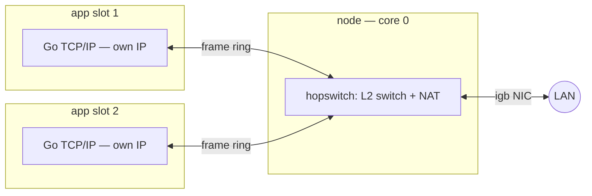

# Networking

Every app gets a **real network stack of its own** — not a socket API into
a shared kernel.

- **Frame rings per slot.** Each app's partition tail holds two SPSC rings
  (RX/TX) of raw Ethernet frames. The app runs Go's full TCP/IP on top —
  `net.Listen` and `net.Dial` just work, on the app's own IP.
- **hopswitch in the node.** Core 0 runs a small L2 switch: app↔app traffic
  switches internally; app↔world goes through NAT to the uplink NIC.
  Published ports (`ports` in the job spec) are stateless DNAT rules from
  the node IP to the app's stack — the app binds the same port number it is
  published on (`ER_PORT_<NAME>`).
- **Isolation carries over.** An app never touches the NIC; it can only
  produce and consume frames in its own rings. Sniffing a neighbour is not
  a permission question — the frames are simply not in its address space.
- **DHCP at the edge only.** The node acquires one lease for the uplink;
  the internal net is static and invisible to the LAN.

Measured on a 128-core Altra with a 1 GbE igb NIC: 126 apps downloading
simultaneously sustain ~33 MB/s aggregate through the switch; a single
flow takes essentially the line. The datapath is cache-tuned (descriptors
uncached, frame buffers write-back with explicit maintenance — the Linux
coherent/streaming split).

Depth (Dutch design notes): [network bring-up](../archief/handoff-netwerk.md),
[uefi/igb](../archief/uefi.md).
