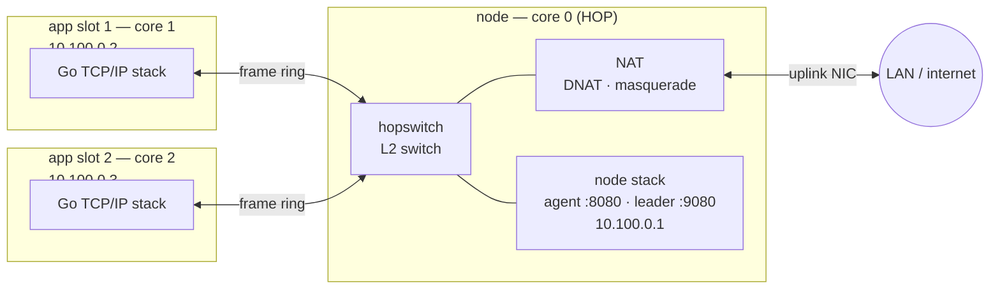

# Networking

Every app on a HopOS node gets a **real, private TCP/IP stack of its own** —
not a socket API into a shared kernel. Go's entire networking suite
(`net`, `net/http`, TLS, WebSockets, gRPC) runs *inside the app*, on the
app's own IP address, on the app's own core. Core 0 is a small **L2 frame
switch**: it moves raw Ethernet frames between apps and to the outside world,
and it never terminates a TCP connection.

The design in one line: **apps compute, HOP moves frames.**

## The addressing plan — deterministic, no DHCP inside

The internal network is the same on every node and needs no server to hand
out addresses. Everything is derived from the slot number, so the switch and
each app's stack compute identical values and can never drift
([`metal/abi/layout`](../../metal/abi/layout/layout.go)):

| | IP | MAC |
|---|---|---|
| HOP (the gateway / "my node") | `10.100.0.1` | `02:00:00:00:00:00` |
| app slot 1 | `10.100.0.2` | `02:00:00:00:00:01` |
| app slot *i* | `10.100.0.(i+1)` | `02:00:00:00:00:0i` |

Subnet `10.100.0.0/24`, HOP is the default route. Because addresses are
deterministic, apps talk to each other by IP with **no DNS and no service
discovery** on the internal net. The whole plan is invisible to your LAN —
only the node's uplink address is real out there.

## The substrate: per-slot frame rings

Each app's memory partition ends in two single-producer/single-consumer
rings — TX (app → switch) and RX (switch → app) — carrying raw Ethernet
frames, 1 MB of capacity per direction
([layout](../../metal/abi/layout/layout.go): `NetTXOff` / `NetRXOff`). The
app runs its stack on top; the switch is the sole counterpart on the other
end. This is the isolation boundary made physical (see below).

## The switch: three destinations

Core 0 drains every slot's TX ring and forwards each frame on its
destination MAC ([`hopswitch.go`](../../metal/net/hopswitch/hopswitch.go)).
There are exactly three things a frame can be:

1. **App → app (internal).** Destination is another slot's MAC. The switch
   copies the frame straight into that slot's RX ring — ring to ring, on
   core 0, never through any TCP stack. Two apps on the same node talk at
   memory-copy speed.
2. **App → the node itself.** Destination is `10.100.0.1`. HOP hangs on its
   own switch as "port 0": a second internal NIC on the node's stack
   ([`gateway.go`](../../metal/net/hopswitch/gateway.go),
   [`internal.go`](../../metal/net/hopnet/internal.go)). An app reaches the
   agent (`:8080`) and the leader (`:9080`) on `10.100.0.1` directly — no
   NAT, no proxy, and **not one byte leaves the physical NIC**.
3. **App → world (and back).** Destination is the gateway MAC but the IP is
   somewhere out on the internet. This is NAT territory (next two sections).

ARP is handled the same deterministic way: a request for the gateway is
answered by HOP itself; a request for another slot is flooded and answered by
that slot.

## Publishing a port (inbound DNAT)

A job's `ports` become **stateless DNAT rules**: `node-IP:port` →
`slot-IP:port`. Every inbound packet just gets its headers rewritten
(destination address + port, checksums patched incrementally per RFC 1624 —
no per-connection state, no connection table) and is dropped into the target
slot's ring ([`nat.go`](../../metal/net/hopswitch/nat.go), `dnatInLocked`).
The app binds the same port number it is published on, handed to it as
`ER_PORT_<NAME>`. This is how the outside world reaches a service running on
an app core.

## Reaching out (outbound masquerade / PAT)

When an app dials out — an HTTP client, a database driver, `cloudflared`, a
DNS query — HOP masquerades it: source `slot-IP:port` → `node-IP:node-port`,
out the uplink, and the reply is rewritten back and delivered straight into
the slot's RX ring ([`nat.go`](../../metal/net/hopswitch/nat.go),
`natOutbound` / `replyInLocked`). It is **conntrack-light**, on purpose:

- TCP and UDP both (so QUIC and DNS work).
- Flows expire on **inactivity** (TCP 300 s, UDP 60 s) — HOP does not follow
  TCP state machines. Long-lived tunnels stay alive on their own keepalives.
- A hard cap (`maxFlows` = 4096) means a busy or hostile app can never
  exhaust core 0's heap.
- **HOP still never terminates a TCP connection** — it rewrites headers and
  forwards the frame. No proxy, no second stack in the path.

The next-hop MAC is learned passively from inbound frames (`srcIP → srcMAC`;
anything off-subnet arrived via the gateway, so that is the gateway's MAC).
For an on-subnet destination never seen before, HOP sends one rate-limited
ARP request and the retransmit finds it.

## Failure handling: an instant RST when a slot dies

A hard-killed app never sends a FIN, so without help its peers would hang
until their own read timeout (the GUI display once waited 30 s for a window
to disappear). HOP closes that gap ([`rst.go`](../../metal/net/hopswitch/rst.go)):
the switch passively tracks the next expected TCP sequence number for every
connection (slot↔slot and slot→outside), and when a slot is torn down it
sends each peer a **correctly-sequenced TCP RST** — so a dead connection
becomes an ordinary connection error immediately. This needs **zero
cooperation from the app**, so it also covers crashes and hangs. It is the
kernel's job, done once, authoritatively — apps don't send their own.

## Isolation carries over to the network

An app never touches the NIC and never sees another app's frames. It can only
put frames into, and take frames out of, **its own two rings** — which live
in its own memory partition, behind the same stage-2 MMU cage that isolates
its memory (see [Isolation](isolation.md)). Sniffing a neighbour isn't a
permission that's denied; the frames are simply **not in its address space**.
A compromised app cannot promiscuously read the wire, spoof another slot's
MAC onto the LAN, or reach the uplink directly.

## The node's own uplink

HOP brings up the real NIC under the [gVisor](https://gvisor.dev) pure-Go
network stack and hooks it into Go's standard `net` package, so the
agent/leader get ordinary `net.Listen` / `net/http`
([`hopnet.go`](../../metal/net/hopnet/hopnet.go)). The driver is the board's:
`virtionet` on QEMU, `igb` on the Ampere Altra, GENET/GEM (over the RP1
bridge) on the Raspberry Pi. **DHCP happens only at the edge** — the node
acquires one lease for the uplink and renews it; the internal net is static.
DNS comes from the node config and is passed to apps as `HOP_DNS`.

## Two stacks, your choice

The default app stack is gVisor's `go-net`. Building an app with
`-tags lnetonet` swaps in the lighter [lneto](../../metal/app/applib/appnet/up_lneto.go)
stack instead — a smaller image when you don't need gVisor's full feature
set. The switch and wire protocol are identical either way.

## Honest limits

Two things are deliberately not handled yet (KISS — they'll come when a real
workload needs them):

- **Hairpin NAT**: an internal client hitting the node's *external* IP.
  Use the slot IP (or `10.100.0.1` for node services) instead.
- **On-subnet first contact** to a host HOP itself has never spoken to
  resolves on the retransmit, not the first packet.

## Measured

On a 128-core Ampere Altra with a 1 GbE `igb` NIC: 126 apps downloading
their images simultaneously sustain ~33 MB/s aggregate through the switch,
while a single flow takes essentially the whole line. The datapath is
cache-tuned — descriptors uncached, frame buffers write-back with explicit
maintenance (the Linux coherent/streaming split).

---

Depth (Dutch design notes): [network bring-up](../archief/handoff-netwerk.md),
[uefi/igb](../archief/uefi.md).
