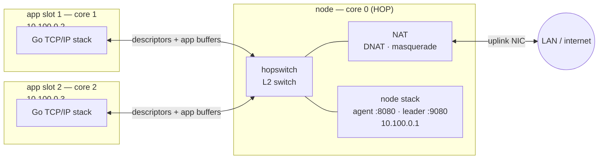

# Networking

Every app on a HopOS node gets a **real, private TCP/IP stack of its own** —
not a socket API into a shared kernel. Go's entire networking suite
(`net`, `net/http`, TLS, WebSockets, gRPC) runs *inside the app*, on the
app's own IP address, on the app's own core. Core 0 is a small **L2 frame
switch**: it moves raw Ethernet frames between apps and to the outside world,
and it never terminates a TCP connection.

The design in one line: **apps compute, HOP moves frames.**

```mermaid
flowchart LR
  subgraph s1["app slot 1 — core 1<br/>10.100.0.2"]
    A["Go TCP/IP stack"]
  end
  subgraph s2["app slot 2 — core 2<br/>10.100.0.3"]
    B["Go TCP/IP stack"]
  end
  subgraph n0["node — core 0 (HOP)"]
    direction TB
    S["hopswitch<br/>L2 switch"]
    N["NAT<br/>DNAT · masquerade"]
    G["node stack<br/>agent :8080 · leader :9080<br/>10.100.0.1"]
    S --- N
    S --- G
  end
  A <-- "descriptors + app buffers" --> S
  B <-- "descriptors + app buffers" --> S
  N <-- "uplink NIC" --> L(("LAN / internet"))
```

## The addressing plan — deterministic, no DHCP inside

The internal network is the same on every node and needs no server to hand
out addresses. Everything is derived from the slot number, so the switch and
each app's stack compute identical values and can never drift
([`metal/abi/layout`](../../metal/abi/layout/layout.go)):

| | IP | MAC |
|---|---|---|
| HOP (the gateway / "my node") | `10.100.0.1` | `02:00:00:00:00:00` |
| app slot 1 | `10.100.0.2` | `02:00:00:00:00:01` |
| app slot *i* | `10.100.0.(i+1)` | `02:00:00:00:00:0i` |

Subnet `10.100.0.0/24`, HOP is the default route. Because addresses are
deterministic, apps talk to each other by IP with **no DNS and no service
discovery** on the internal net. The whole plan is invisible to your LAN —
only the node's uplink address is real out there.

## The substrate: descriptors, not fixed payload rings

Each app gets two fixed one-page single-producer/single-consumer queues: TX
(app → switch) and RX (switch → app). Their descriptors contain only an offset,
length and token. The actual bytes remain in ordinary buffers inside that app's
already caged RAM partition. Before touching a frame HOP validates the complete
offset range against that partition; another app's memory is therefore not
addressable through this contract.

RX is offer-based. The app normally keeps a small number of empty buffers in
its RX queue. If a burst arrives while there is no offer, HOP borrows 2 KiB
chunks on demand from one node-wide frame pool. The chunks have no permanent
owner: delivery, detach or drop returns them immediately. A slow receiver thus
uses more of the pool while it is slow, without every possible slot reserving
the same payload capacity forever. A small admission reserve prevents one
stalled app from emptying the pool for every other attached app; exhaustion is
an Ethernet drop and TCP performs the recovery.

Only the two descriptor pages are mapped into an app at the fixed network IPA.
The global frame pool is HOP-only and never appears in an app's cage. ARM and
RISC-V use this same queue contract; only their cache-maintenance seam differs.

## The switch: three destinations

Core 0 drains every slot's TX ring and forwards each frame on its
destination MAC ([`hopswitch.go`](../../metal/net/hopswitch/hopswitch.go)).
There are exactly three things a frame can be:

1. **App → app (internal).** Destination is another slot's MAC. The switch
   copies the frame straight into an offered RX buffer — or briefly into the
   shared pool when none is offered — on core 0, never through any TCP stack.
   Two apps on the same node talk at memory-copy speed.
2. **App → the node itself.** Destination is `10.100.0.1`. HOP hangs on its
   own switch as "port 0": a second internal NIC on the node's stack
   ([`gateway.go`](../../metal/net/hopswitch/gateway.go),
   [`internal.go`](../../metal/net/hopnet/internal.go)). An app reaches the
   agent (`:8080`) and the leader (`:9080`) on `10.100.0.1` directly — no
   NAT, no proxy, and **not one byte leaves the physical NIC**.
3. **App → world (and back).** Destination is the gateway MAC but the IP is
   somewhere out on the internet. This is NAT territory (next two sections).

ARP is handled the same deterministic way: a request for the gateway is
answered by HOP itself; a request for another slot is flooded and answered by
that slot.

## Publishing a port (inbound DNAT)

A job's `ports` become **stateless DNAT rules**: `node-IP:port` →
`slot-IP:port`. Every inbound packet just gets its headers rewritten
(destination address + port, checksums patched incrementally per RFC 1624 —
no per-connection state, no connection table) and is dropped into the target
slot's RX path ([`nat.go`](../../metal/net/hopswitch/nat.go), `dnatInLocked`).
The app binds the same port number it is published on, handed to it as
`ER_PORT_<NAME>`. This is how the outside world reaches a service running on
an app core.

The same address works from the *inside* too (**hairpin**): an app dialing
its own node's LAN IP on a published port is rerouted internally — the DNAT
rule picks the target slot, the masquerade table disguises the caller as the
node so the reply finds its way back, and the frame goes buffer-to-buffer
without ever touching the NIC (`hairpinOutLocked` / `hairpinBackLocked`). One port
number per host, one address that is true everywhere: DNS gets you to the
right host, the switch takes the shortcut when that host is you.

## Reaching out (outbound masquerade / PAT)

When an app dials out — an HTTP client, a database driver, `cloudflared`, a
DNS query — HOP masquerades it: source `slot-IP:port` → `node-IP:node-port`,
out the uplink, and the reply is rewritten back and delivered straight into
the slot's RX ring ([`nat.go`](../../metal/net/hopswitch/nat.go),
`natOutbound` / `replyInLocked`). It is **conntrack-light**, on purpose:

- TCP and UDP both (so QUIC and DNS work).
- Flows expire on **inactivity** (TCP 300 s, UDP 60 s) — HOP does not follow
  TCP state machines. Long-lived tunnels stay alive on their own keepalives.
- A hard cap (`maxFlows` = 4096) means a busy or hostile app can never
  exhaust core 0's heap.
- **HOP still never terminates a TCP connection** — it rewrites headers and
  forwards the frame. No proxy, no second stack in the path.

The next-hop MAC is learned passively from inbound frames (`srcIP → srcMAC`;
anything off-subnet arrived via the gateway, so that is the gateway's MAC).
For an on-subnet destination never seen before, HOP sends one rate-limited
ARP request and the retransmit finds it.

## Failure handling: noticing a dead peer is the app's job

A hard-killed app never sends a FIN, so its peers see **silence** — not a
connection error. They find out when their own heartbeat or read deadline
expires.

That is deliberate. A switch or a router can drop a live connection silently
at any moment and there is no signal for it, so an app has to survive silence
regardless. Once it does, a shortcut for one particular cause of silence buys
nothing but code: HopOS already has two layers that cover this — the health
check on the task, and the app's own ping. HOP briefly forged
correctly-sequenced TCP RSTs on teardown to make slot death instant; that was
a third layer for the same failure, and it cost per-frame TCP sequence
tracking in the switch, so it was removed (26-07).

**What this means for an app:** if you want to notice a dead peer quickly, set
your read deadline to a small multiple of your ping interval. Shorter than the
ping interval kills healthy connections. An app with neither a heartbeat nor a
deadline will hang until TCP gives up retransmitting, which takes minutes —
that is the same behaviour it would get from any real network.

## Isolation carries over to the network

An app never touches the NIC and never sees another app's frames. It can only
put frames into, and take frames out of, **its own two rings** — which live
in its own memory partition, behind the same stage-2 MMU cage that isolates
its memory (see [Isolation](isolation.md)). Sniffing a neighbour isn't a
permission that's denied; the frames are simply **not in its address space**.
A compromised app cannot promiscuously read the wire, spoof another slot's
MAC onto the LAN, or reach the uplink directly.

## The node's own uplink

HOP brings up the real NIC under a pure-Go TCP/IP stack — `lneto`, reached
through `go-net`, which hooks it into Go's standard `net` package, so the
agent/leader get ordinary `net.Listen` / `net/http`
([`hopnet.go`](../../metal/net/hopnet/hopnet.go)). Both come from our own forks
([xinix00/lneto](https://github.com/xinix00/lneto),
[xinix00/go-net](https://github.com/xinix00/go-net)) because bringing this up on
metal turned up correctness bugs we had to fix; those fixes are open upstream
PRs, and the fork disappears when they land
([netstack-upstream.md](../netstack-upstream.md), Dutch). The driver is the
board's:
`virtionet` on QEMU, `igb` on the Ampere Altra, GENET/GEM (over the RP1
bridge) on the Raspberry Pi, `dwmac` with the SoC's internal ePHY on the
LicheeRV Nano. **DHCP happens only at the edge** — the node
acquires one lease for the uplink and renews it; the internal net is static.
DNS comes from the node config and is passed to apps as `HOP_DNS`.

## Honest limits

Two things are deliberately not handled yet (KISS — they'll come when a real
workload needs them):

- **Node services on the LAN IP from the inside**: hairpin covers *published
  job ports* only; the agent and leader live on `10.100.0.1` for apps.
- **On-subnet first contact** to a host HOP itself has never spoken to
  resolves on the retransmit, not the first packet.

The datapath is cache-tuned — descriptors uncached, frame buffers write-back
with explicit maintenance (the Linux coherent/streaming split). Throughput
numbers are being re-measured on the current stack; the ones that used to
stand here were taken on the old per-app loader path, which no longer exists.

---

Depth (Dutch design notes): [network bring-up](../archief/handoff-netwerk.md),
[uefi/igb](../archief/uefi.md).
