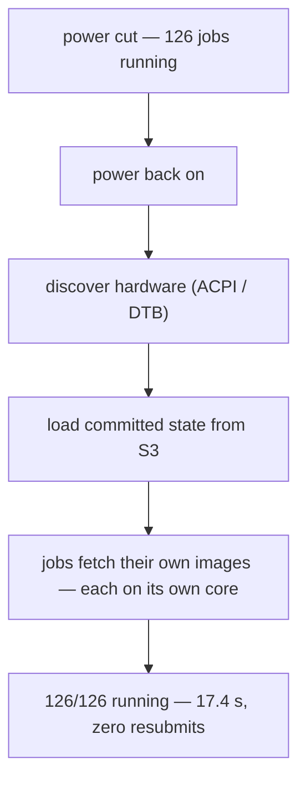

# Stateless

**State on S3, not on metal.** A HopOS node owns nothing:

- The boot medium carries a **signed image and six lines of config** —
  that is the entire local footprint. There is no disk install, no package
  state, no config drift, nothing to back up.
- **Desired state lives in S3.** The leader commits the cluster's jobs as
  one object; leader election runs on a CAS lock in the same bucket.
- **Apps fetch themselves.** A job start downloads its image from the
  artifact URL — on the app's own core — and runs it. Even shared data is
  designed to be *fetched, not owned*.

## What that buys you

- **Reboot recovery is not a feature, it's the boot path.** Every boot is
  identical: discover hardware → join cluster → load committed state →
  jobs fetch their images. A power cut just exercises it.
- **"Reinstall" means re-imaging a USB stick.** A broken node is a stick
  swap; a lost machine is the same stick in a different box.
- **Updates are a file copy.** New image on the stick (or served over
  signed HTTP), reboot — the state comes back by itself.
- **Nothing to steal.** A machine walking out of the rack carries no data
  and no state — only the boot stick matters (see the
  [trust model](../config.md#trust-model)).
